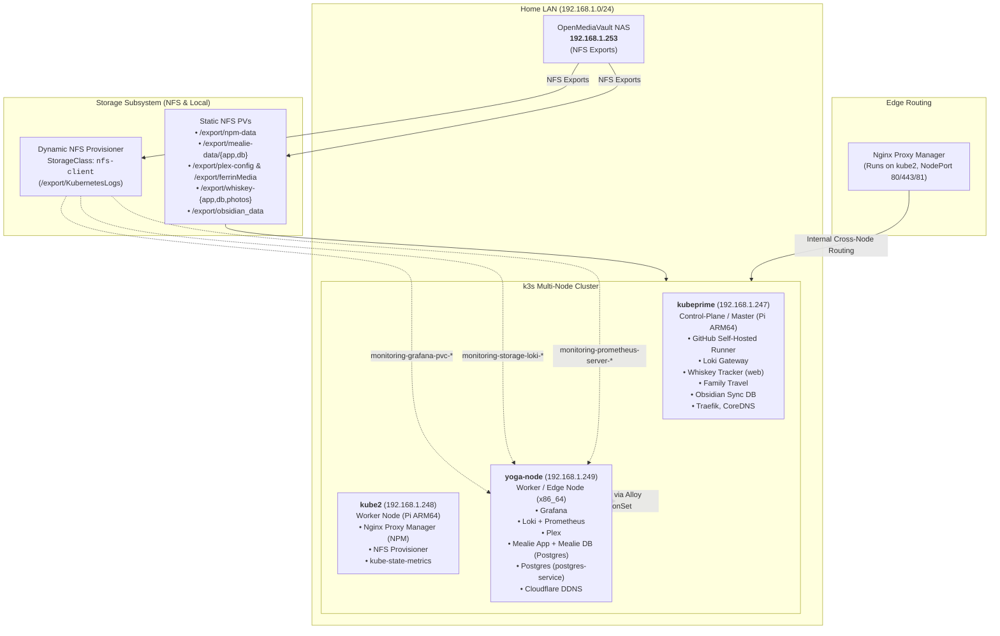
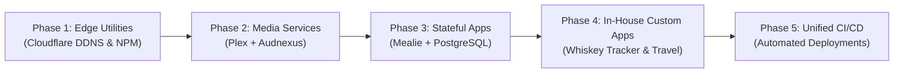

# 🏡 Ferrin Homelab Operations (`homelab-ops`)

Welcome to the **Ferrin Homelab** infrastructure and operations repository. This repository houses the Kubernetes manifests, Helm values, observability pipelines, and GitOps automation powering a multi-node hybrid Kubernetes (**k3s**) cluster running on **Raspberry Pi (ARM64)** and **x86_64** hardware, backed by an **OpenMediaVault (OMV)** Network Attached Storage (NAS) system.

---

## 📑 Table of Contents

- [Architecture Overview](#-architecture-overview)
- [Cluster Hardware & Node Inventory](#-cluster-hardware--node-inventory)
- [Two Deployment Models (GitOps vs Direct Manifests)](#-two-deployment-models-gitops-vs-direct-manifests)
- [Storage Topology & Volume Matrix](#-storage-topology--volume-matrix)
  - [Dynamic Provisioning & OMV Folder Naming](#dynamic-provisioning--omv-folder-naming)
  - [Comprehensive Storage Matrix](#comprehensive-storage-matrix)
- [Networking & Ingress Routing](#-networking--ingress-routing)
- [Service Catalog & Port Allocations](#-service-catalog--port-allocations)
- [Workload Overview](#-workload-overview)
- [Observability Stack (Loki, Alloy, Grafana, Prometheus)](#-observability-stack)
- [CI/CD & GitOps Automation](#-cicd--gitops-automation)
- [Operations & "Where Are My Files?" Runbook](#-operations--where-are-my-files-runbook)
- [Future Architecture & Helm Migration Roadmap](#-future-architecture--helm-migration-roadmap)
- [Security & Secrets Management](#-security--secrets-management)

---

## 🏛 Architecture Overview



> [!NOTE]
> **Pod placement is decided by the Kubernetes scheduler, not pinned.** Only Obsidian Sync DB (`kubeprime`)
> and Family Travel (`arm64`) carry a `nodeSelector`. Everything else lands wherever there is capacity, so the
> node lists above are a **snapshot (2026-09-20)** and will drift. Check the live state with
> `sudo k3s kubectl get pods -A -o wide`. Because most services are reached across nodes, the health of the
> flannel overlay (see [runbook](#5-a-service-works-on-one-node-ip-but-times-out-on-the-others)) matters more
> than which node a pod is on.

---

## 🖥 Cluster Hardware & Node Inventory

The cluster is a multi-architecture hybrid running **k3s v1.33.4+k3s1** with **containerd v2.0.5-k3s2**:

| Node Name | IP Address | Roles | Architecture | OS & Kernel | Primary Workloads Hosted |
| :--- | :--- | :--- | :--- | :--- | :--- |
| **`kubeprime`** | `192.168.1.247` | `control-plane,master` | ARM64 (Raspberry Pi) | Debian 12 (bookworm) / `6.12.25+rpt-rpi-v8` | Self-hosted GitHub Runner, Loki Gateway, Whiskey Tracker (web), Family Travel, Obsidian Sync DB, Traefik, CoreDNS, metrics-server |
| **`kube2`** | `192.168.1.248` | `worker` | ARM64 (Raspberry Pi) | Debian 12 (bookworm) / `6.12.25+rpt-rpi-v8` | Nginx Proxy Manager, NFS Provisioner, kube-state-metrics |
| **`yoga-node`** | `192.168.1.249` | `edge,worker` | x86_64 (amd64) | Debian 13 (trixie) / `6.12.107+deb13-amd64` | Grafana, Loki, Prometheus, Plex, Mealie App + DB, Postgres (`postgres-service`), Cloudflare DDNS |

Every node also runs an **Alloy** collector, a **Loki canary**, a **node-exporter** and the K3s **ServiceLB**
proxy pods (`svclb-*`) as DaemonSets. `yoga-node` is the newest node (it joined in early September 2026), and
most of the stateful and monitoring workloads have since been scheduled onto it.

> [!NOTE]
> `yoga-node` reaches the LAN through a **USB Ethernet adapter** (`enx9cebe86649fd`) inside a **Dell Universal Dock
> D6000**, and that is the interface flannel binds to for pod networking. The pods on `kubeprime`/`kube2` reach
> Grafana, Loki, Prometheus and the databases on `yoga-node` across this link. **A dock reset has been confirmed
> to silently break the overlay** (an earlier outage the day before looks identical); see the [runbook](#5-a-service-works-on-one-node-ip-but-times-out-on-the-others)
> for the cause and the auto-heal script.

---

## ⚙️ Two Deployment Models (GitOps vs Direct Manifests)

One of the most important architectural aspects of this homelab is that **workloads are managed under two different paradigms**:

### Model A: Automated GitOps & Helm (Observability & Storage)
- **Workloads**: `grafana`, `loki`, `alloy`, `prometheus` (namespace `monitoring`), `nfs-subdir-external-provisioner` (namespace `storage`).
- **Source of Truth**: This repository (`homelab-ops`) under `k8s/monitoring/` and `k8s/storage/`.
- **How It Deploys**: A self-hosted GitHub Actions runner on `kubeprime` runs [`.github/workflows/ci.yaml`](.github/workflows/ci.yaml) on push to `main`.
- **On-Disk Checkout on the Pi**:
  ```text
  /home/mferrin/actions-runner/_work/homelab-ops/homelab-ops/
  ```
- **Runtime Configuration**: Helm compiles values directly into Kubernetes **ConfigMaps** (`grafana`, `alloy`, `loki-runtime`) and Secret release states.

### Model B: Direct Host Manifests (Application Workloads)
- **Workloads**: `npm`, `mealie`, `plex`, `familyTravel`, `cloudflare-ddns`, `obsidian`.
- **Source of Truth**: Direct YAML manifests located in `/home/mferrin/` on `kubeprime`:
  - `/home/mferrin/mealie-all-in-one.yml`
  - `/home/mferrin/npm-all-in-one.yml`
  - `/home/mferrin/plex-deployment.yml` (and associated `plex-*.yml`)
  - `/home/mferrin/cloudflare-ddns.yaml`
  - `/home/mferrin/familyTravel/familyTravel.yaml`
- **How It Deploys**: Applied manually via `sudo k3s kubectl apply -f <file>.yml`.

---

## 💾 Storage Topology & Volume Matrix

The persistent storage backbone is a dedicated **OpenMediaVault (OMV)** NAS server at **`192.168.1.253`**.

### Dynamic Provisioning & OMV Folder Naming

The cluster runs `nfs-subdir-external-provisioner` with the default StorageClass **`nfs-client`** pointing to `/export/KubernetesLogs`.

> [!IMPORTANT]
> **How Dynamic Folders are Named on OMV:**  
> When Helm or Kubernetes provisions a dynamic volume using `nfs-client`, it does **not** create a simple folder named `grafana`. Instead, it automatically generates a directory following the format:
> `/<export-root>/<namespace>-<pvc-name>-<pv-uuid>/`

| Application | Volume Claim | Exact OMV Share & Directory Path |
| :--- | :--- | :--- |
| **Grafana** | `monitoring/grafana` | `/export/KubernetesLogs/monitoring-grafana-pvc-ebd72568-2350-49de-8b50-c18169c3c3a2/` |
| **Loki** | `monitoring/storage-loki-0` | `/export/KubernetesLogs/monitoring-storage-loki-0-pvc-66c40a15-8cf0-4990-ab6d-64b0b84f28c2/` |
| **Prometheus** | `monitoring/prometheus-server` | `/export/KubernetesLogs/monitoring-prometheus-server-.../` |

### Comprehensive Storage Matrix

| Volume Name | Type | OMV / Host Path | Target Pod & Mount | Capacity | Mode |
| :--- | :--- | :--- | :--- | :--- | :--- |
| `pvc-ebd725...` | Dynamic NFS | `192.168.1.253:/export/KubernetesLogs/monitoring-grafana-...` | Grafana (`/var/lib/grafana`) | 2 Gi | RWO |
| `pvc-66c40a...` | Dynamic NFS | `192.168.1.253:/export/KubernetesLogs/monitoring-storage-loki-...` | Loki (`/var/loki`) | 50 Gi | RWO |
| `pvc-prometheus...` | Dynamic NFS | `192.168.1.253:/export/KubernetesLogs/monitoring-prometheus-server-...` | Prometheus Server (`/data`) | 20 Gi | RWO |
| `nfs-npm-pv` | Static NFS | `192.168.1.253:/export/npm-data` | NPM (`/data`, `/etc/letsencrypt`) | 5 Gi | RWX |
| `nfs-mealie-app-pv` | Static NFS | `192.168.1.253:/export/mealie-data/app` | Mealie App (`/app/data`) | 15 Gi | RWX |
| `nfs-mealie-db-pv` | Static NFS | `192.168.1.253:/export/mealie-data/db` | Mealie Postgres (`/var/lib/postgresql/data`) | 10 Gi | RWX |
| `nfs-plex-config-pv`| Static NFS | `192.168.1.253:/export/plex-config` | Plex Config (`/config`) | 20 Gi | RWX |
| `nfs-plex-media-pv` | Static NFS | `192.168.1.253:/export/ferrinMedia` | Plex Media (`/media`) | 1000 Gi | RWX |
| `whiskey-app-pv` | Static NFS | `192.168.1.253:/export/whiskey-app` | Whiskey Tracker Web | 1 Gi | RWX |
| `whiskey-db-pv` | Static NFS | `192.168.1.253:/export/whiskey-db` | Whiskey Tracker DB | 10 Gi | RWO |
| `whiskey-photos-pv`| Static NFS | `192.168.1.253:/export/whiskey-photos` | Whiskey Tracker Photos | 10 Gi | RWX |
| `nfs-storage` | Static NFS | `192.168.1.253:/export/obsidian_data` | Obsidian Sync DB | 10 Gi | RWX |
| `travel-site-pv` | Static NFS | `192.168.1.253:/export/travel-db` | Travel App SQLite DB (`/app/database/travel.db`) | 1 Gi | RWX |

---

## 🌐 Networking & Ingress Routing

### NodePort Cross-Node Mesh Behavior
In Kubernetes, **a `NodePort` is accessible on every node's IP address**, regardless of where the pod is physically running:
- Grafana's pod currently runs on **`yoga-node` (`192.168.1.249`)**.
- However, pointing to **`192.168.1.247:30001` (`kubeprime`)** works seamlessly because `kube-proxy` transparently routes the packets across the internal flannel CNI network (`10.42.x.x`).
- The flip side: if the flannel overlay breaks on a node, that NodePort **only answers on the node that hosts the pod** and
  times out on the others (see the [runbook](#5-a-service-works-on-one-node-ip-but-times-out-on-the-others)).
- **Nginx Proxy Manager (NPM)** is configured as the front-door reverse proxy, handling domain names and Let's Encrypt SSL certificates before proxying upstream to these NodePorts.

---

## 📋 Service Catalog & Port Allocations

| Service Name | Namespace | Node Hosted | Service Type | Internal Port | NodePort / Exposed Port | Upstream Routing URL |
| :--- | :--- | :--- | :--- | :--- | :--- | :--- |
| **Grafana** | `monitoring` | `yoga-node` | `NodePort` | `80` | **`30001`** | `http://192.168.1.247:30001` |
| **Mealie App** | `default` | `yoga-node` | `NodePort` | `9000` | **`30925`** | `http://192.168.1.247:30925` |
| **Mealie Database**| `default` | `yoga-node` | `ClusterIP` | `5432` | None (Internal) | `mealiedb-service:5432` |
| **Postgres** | `default` | `yoga-node` | `ClusterIP` | `5432` | None (Internal) | `postgres-service:5432` |
| **Whiskey Tracker** | `default` | `kubeprime` | `NodePort` | `80` | **`30080`** | `http://192.168.1.247:30080` |
| **Obsidian CouchDB** | `default` | `kubeprime` | `NodePort` | `5984` | **`30584`** | `http://192.168.1.247:30584` |
| **Family Travel** | `default` | `kubeprime` | `NodePort` | `80` | **`30090`** | `http://192.168.1.247:30090` |
| **NPM HTTP/S/Admin** | `default` | `kube2` | `NodePort` | `80`, `443`, `81` | `30774`, `32316`, `30943` | External gateway (NodePorts per `npm-service`) |
| **Plex Media Web** | `default` | `yoga-node` | `LoadBalancer` | `32400` | `32400` | `http://<node-ip>:32400` |
| **Traefik** | `kube-system` | `kubeprime` | `LoadBalancer` | `80`, `443` | `32662`, `30845` | ServiceLB on every node |
| **Loki Gateway** | `monitoring` | `kubeprime` | `ClusterIP` | `80` | None (Internal) | `http://loki-gateway.monitoring.svc.cluster.local` |
| **Loki** | `monitoring` | `yoga-node` | `ClusterIP` | `3100` | None (Internal) | `http://loki.monitoring.svc.cluster.local:3100` |
| **Prometheus Server** | `monitoring` | `yoga-node` | `ClusterIP` | `80` | None (Internal) | `http://prometheus-server.monitoring.svc.cluster.local` |
| **Kubernetes API** | `kube-system` | `kubeprime` | Native API | `6443` | `6443` | `https://kubeprime:6443` |

> Node placement in this table is a snapshot from 2026-09-20; see the note under the architecture diagram.

---

## 📦 Workload Overview

### 1. Observability Stack (`monitoring` namespace)
- **Grafana**: Visualizations and dashboards, pinned to NodePort `30001`, dynamically backed by 2 Gi on OMV. Pre-wired with internal Loki and Prometheus datasources.
- **Loki**: Deployed in `SingleBinary` mode, TSDB v13 schema, with distributed memory caches disabled to fit comfortably within Pi RAM.
- **Prometheus**: Metrics storage deployed via Helm (`prometheus-community/prometheus`) with 20 Gi dynamic NFS storage on OMV (15-day retention), Node Exporter daemonset for host-level hardware and OS telemetry (`node_*`), and resource limits optimized for Raspberry Pi. Heavy auxiliary components (Alertmanager, Pushgateway) are disabled to preserve RAM.
- **Grafana Alloy**: Deployed as a `DaemonSet` running on all nodes (`kubeprime`, `kube2`, `yoga-node`). It tails all pod logs and extracts structured JSON fields (`Level`, `Message`, `WhiskeyName`, `Query`) for the Whiskey Tracker app before shipping to Loki.

### 2. Application Services (`default` namespace)
- **Mealie**: Recipe manager with Google Gemini 2.0 Flash AI recipe scraping and Gmail SMTP alerts. Backed by a dedicated PostgreSQL 15 pod.
- **Whiskey Tracker**: In-house .NET 10 web application with persistent database, photos, and app shares on OMV.
- **Obsidian Sync DB**: Self-hosted CouchDB synchronization backend for Obsidian notes, persisting to `/export/obsidian_data`.
- **Cloudflare DDNS**: Automatically keeps external DNS records synchronized with the homelab's dynamic public IP.
- **Plex Media Server**: Media server with an init container cloning/updating the `Audnexus.bundle` plugin for audiobook metadata.
- **Family Travel Adventures**: Modern itinerary, packing, and meal planning web application built with **Next.js 16 (App Router)**, **React 19**, and **Prisma 7** using SQLite (`travel.db`). Deployed from the `travel` repository as a standalone Alpine container (`ghcr.io/ferrinhouse/travel-site:latest`) with automatic `prisma db push` migrations on startup, backed by `/export/travel-db` on OMV, and served via NodePort `30090`.

---

## 🚀 CI/CD & GitOps Automation

Automated deployments are managed by GitHub Actions using a self-hosted runner operating on `kubeprime`:
- **Runner Directory**: `/home/mferrin/actions-runner/`
- **Workflow**: [`.github/workflows/ci.yaml`](.github/workflows/ci.yaml)
- **Cluster Target**: Configured via `KUBECONFIG: /etc/rancher/k3s/k3s.yaml`.
- **Automated Deployments**: Upgrades Helm charts for `nfs-provisioner`, `loki`, `prometheus`, `grafana`, and `alloy` upon any push to `main` touching `k8s/monitoring/**` or `k8s/storage/**`.

---

## 🛠 Operations & "Where Are My Files?" Runbook

### "Where Are My Files?" Debugging Guide

#### 1. Why can't I find Grafana/Loki files in `/etc/` or `/var/lib/` on my Pi?
Containers in k3s do not run on the host's raw filesystem; they run inside `containerd` isolated overlays.
- **To inspect files inside the running container**:
  ```bash
  sudo k3s kubectl exec -it -n monitoring deploy/grafana -- ls -la /var/lib/grafana
  ```
- **To see the active configuration files (`grafana.ini`, `datasources.yaml`)**:
  ```bash
  sudo k3s kubectl get configmap -n monitoring grafana -o yaml
  ```

#### 2. Where is the SQLite database on OMV?
On your OMV NAS (`192.168.1.253`), navigate to the `/export/KubernetesLogs` share:
```bash
ls -la /export/KubernetesLogs/monitoring-grafana-pvc-*
```
Inside you will find `grafana.db`.

#### 3. How do I inspect the active Helm values for a release?
```bash
sudo KUBECONFIG=/etc/rancher/k3s/k3s.yaml helm get values grafana -n monitoring
```

#### 4. How do I manually deploy or upgrade Prometheus on kubeprime?
```bash
sudo KUBECONFIG=/etc/rancher/k3s/k3s.yaml helm repo add prometheus-community https://prometheus-community.github.io/helm-charts
sudo KUBECONFIG=/etc/rancher/k3s/k3s.yaml helm repo update
sudo KUBECONFIG=/etc/rancher/k3s/k3s.yaml helm upgrade --install prometheus prometheus-community/prometheus \
  --namespace monitoring --create-namespace \
  -f k8s/monitoring/values-prometheus.yaml
```

#### 5. A service works on one node IP but times out on the others
Symptom: e.g. Grafana answers on `192.168.1.249:30001` but `192.168.1.247:30001` and `192.168.1.248:30001` time out,
Alloy logs `context deadline exceeded` pushing to `loki-gateway`, and Prometheus shows `up == 0` for `kube-state-metrics`
(a pod on `kube2` that Prometheus on `yoga-node` can only scrape across the overlay).
This means **cross-node pod networking (the flannel VXLAN overlay) is down on at least one node**, not that the app is down.

```bash
# On the affected node: the VXLAN device and routes to the other nodes' pod CIDRs should exist
ip -br link show flannel.1
ip route | grep 10.42

# From another node: can it reach a pod on the affected node? (use a pod IP from `get pods -o wide`)
ping -c3 <pod-ip>

# Fix: restarting the agent recreates flannel.1 and its routes (pods keep running)
sudo systemctl restart k3s-agent        # on a worker (yoga-node, kube2)
# on kubeprime (the server) the unit is `k3s`, but restarting it interrupts the API server, so plan for that
```

##### Known cause on `yoga-node`: the USB dock resets
`yoga-node`'s only network link is the NIC inside a **Dell Universal Dock D6000** (USB `17e9:6006`, `cdc_ncm` driver).
`flannel.1` is a VXLAN device built on that NIC, so when the dock resets, the kernel unregisters the NIC and deletes
`flannel.1` in the same second. The NIC is back within a few seconds (NetworkManager re-DHCPs the same IP), but
`k3s-agent` never recreates `flannel.1`, so the overlay stays down until the agent is restarted. Every pod stays
`Running` the whole time, which is why it is easy to miss.

To confirm it was this (the journal is persistent, so this works **after** a restart too), look for the sequence
around the time `up` dropped to `0`:
```bash
sudo journalctl --since "<date> <time>" --until "<date> <time+10m>" --no-pager | grep -E \
  "reset SuperSpeed|unregister 'cdc_ncm'|flannel.1.*removed|not found in the host's network interfaces"
# usb 2-4.1: reset SuperSpeed USB device number 3 using xhci_hcd       <- the dock resets
# cdc_ncm ... enx9cebe86649fd: unregister 'cdc_ncm' ...               <- NIC removed
# NetworkManager: device (flannel.1): ... 'removed'                   <- flannel.1 goes with it
# k3s: node IP "192.168.1.249" not found in the host's network interfaces
```
The USB reset itself has no known trigger yet (nothing was logged in the ~3 minutes before it). The dock's DisplayLink video interface
is not claimed by any driver, and USB autosuspend is already disabled (`usbcore.autosuspend=-1`), so neither looks
responsible. Swapping the dock's cable/port, or using a plain USB Ethernet adapter instead of the dock, are the
cheapest experiments.

##### Auto-heal: `hosts/yoga-node/90-flannel-heal`
A NetworkManager dispatcher script that restarts `k3s-agent` when the NIC comes back up and `flannel.1` is missing
(and does nothing otherwise, including at boot). It turns a hours-long silent outage into a blip of a few seconds.

> [!IMPORTANT]
> **CI does not deploy this.** `ci.yaml` only applies Kubernetes manifests and Helm values, and its runner lives on
> `kubeprime`. The file in the repo is the source of truth and a record of why it exists; it must be installed on
> `yoga-node` by hand, and again if `yoga-node` is rebuilt.

```bash
# On yoga-node, from a checkout of this repo (NetworkManager ignores scripts that are not root-owned or are group/world-writable)
sudo install -o root -g root -m 0755 hosts/yoga-node/90-flannel-heal /etc/NetworkManager/dispatcher.d/90-flannel-heal

# When it acts, it logs under its own tag:
sudo journalctl -t flannel-heal
```
The script is bound to the NIC by name (`enx9cebe86649fd`, derived from the dock's MAC address). If the dock or adapter
is replaced the name changes and the script silently does nothing until `NIC=` at the top is updated (`ip -br link`).

To test the heal path on purpose (this drops `yoga-node`'s network for a few seconds, so run it from the local console
or inside `tmux`, not over an SSH session that rides the same NIC):
```bash
sudo ip link delete flannel.1 && sudo nmcli connection up "Wired connection 1"
# within ~10-20s: `ip -br link show flannel.1` reappears and `journalctl -t flannel-heal` shows the restart
```

##### Incident log
- **2026-09-19 01:36 to 2026-09-20 ~18:29 (~41h):** `flannel.1` disappeared from `yoga-node`. Found from the symptoms above
  and fixed by restarting `k3s-agent`. Nothing was logged by flannel or k3s, and this outage's journal was not
  inspected, so it is **probably but not provably** the same dock reset.
- **2026-09-20 20:33 to 2026-09-21 ~09:26 (~13h):** same symptom, and here the journal confirms the dock reset
  (`reset SuperSpeed USB device number 3` at 20:33:23, NIC unregistered, `flannel.1` removed in the same second).
  Fixed by restarting `k3s-agent`.

### Routine Cluster Administration Commands

```bash
# Check all nodes and their status
sudo k3s kubectl get nodes -o wide

# Check all pods across the cluster
sudo k3s kubectl get pods -A -o wide

# Check all storage claims
sudo k3s kubectl get pvc -A

# Refresh local Windows kubectl access
# (Copy /etc/rancher/k3s/k3s.yaml from kubeprime to ~/.kube/config and replace 127.0.0.1 with 192.168.1.247)
```

---

## 🔮 Future Architecture & Helm Migration Roadmap

### The Strategic Goal: 100% GitOps & Unified Helm Management
The long-term objective for this cluster is to migrate all remaining "manual" workloads (currently deployed via loose manifests in `/home/mferrin/`) into version-controlled, Helm-managed releases in `homelab-ops`.

### Architectural Decision: Where Container & Deployment Configs Live
For custom in-house applications (**Whiskey Tracker** and **Family Travel**), homelab operations follow the standard **GitOps Separation of Concerns**:

| Repository | Scope & Responsibility | Examples |
| :--- | :--- | :--- |
| **Application Repos**<br/>(`WhiskeyTracker`, `travel`) | **Code & Artifact Build**: Contains application source code, unit tests, Dockerfile, and CI workflows that build and push container images to a registry. | `src/`, `Dockerfile`, `.github/workflows/build.yml` |
| **Infrastructure Repo**<br/>(`homelab-ops`) | **Deployment & Cluster Topology**: Contains Helm values, cluster ingress rules, NodePort allocations, and OMV storage bindings (`192.168.1.253:/export/...`). | `k8s/apps/whiskey/values.yaml`, `k8s/apps/travel/values.yaml` |

#### Why Keep Deployment Configs in `homelab-ops`?
1. **Cluster Portability**: Your application code should not know or care about internal LAN IPs (`192.168.1.253`), specific NFS share paths, or node names (`kube2`).
2. **Single Source of Truth**: Rebuilding the cluster after a disaster only requires running `homelab-ops`.
3. **Secret Containment**: Homelab database credentials and internal network topology stay inside this private infrastructure repository.

### Data Safety Guarantee: The `existingClaim` Pattern
To ensure **zero data loss** when converting existing stateful services (Plex, Mealie, NPM) to Helm:
- Helm templates will declare `existingClaim: <pvc-name>` rather than provisioning new PVCs.
- This forces Kubernetes to simply attach the existing, populated NFS directories on OMV (`192.168.1.253`) directly into the new Helm-managed pods.

### Phased Migration Roadmap



1. **Phase 1: Edge & Network Utilities (Cloudflare DDNS & Nginx Proxy Manager)**:
   - Package Cloudflare DDNS and NPM into Helm charts under `k8s/apps/`. Re-use `npm-pvc` with `existingClaim` so SSL certificates and proxy hosts remain untouched.
2. **Phase 2: Media Services (Plex Media Server)**:
   - Port the Plex deployment and Audnexus init-container into `k8s/apps/plex/`, binding to `plex-config-pvc` (20Gi) and `plex-media-pvc` (1000Gi).
3. **Phase 3: Stateful Third-Party Applications (Mealie & PostgreSQL)**:
   - Create a pre-migration backup of `mealiedb`.
   - Port Mealie to Helm using `existingClaim` for `mealie-app-pvc` and `mealie-db-pvc`.
4. **Phase 4: In-House Custom Workloads (Travel Site & Whiskey Tracker)**:
   - Both **Travel** and **Whiskey Tracker** currently manage active build/deploy pipelines in their respective code repos while in active development.
   - Once their architectures stabilize, evaluate whether to maintain their Kustomize deployment steps in their code repos or transition their release tags to Helm values in `homelab-ops`.
5. **Phase 5: Unified Pipeline Automation**:
   - Expand `.github/workflows/ci.yaml` to monitor `k8s/apps/**` and automate `helm upgrade --install` across all infrastructure workloads.

---

## 🔐 Security & Secrets Management

Application secrets (Mealie SMTP password, Mealie Postgres password, Obsidian CouchDB password,
Cloudflare API token, Travel admin passcode, the GHCR pull secret) are **never committed to this
repository**. Manifests reference them via `secretKeyRef` only.

> [!NOTE]
> Mealie's AI recipe scraping (Gemini) is configured entirely through the Admin UI (Settings → AI
> Providers) and stored in Mealie's own Postgres database — it does **not** read `OPENAI_API_KEY`/
> `OPENAI_MODEL`/`OPENAI_BASE_URL` env vars in current versions, so those were removed from the
> manifest. Rotate that key through the Mealie Admin UI, not GitHub secrets.

The values themselves live as encrypted [GitHub Actions repository secrets](https://github.com/ferrinHouse/homelab-ops/settings/secrets/actions).
On every push to `main` touching `k8s/**`, the self-hosted runner workflow
([`.github/workflows/ci.yaml`](.github/workflows/ci.yaml)) creates/updates the corresponding
Kubernetes `Secret` objects from those GitHub secrets (`kubectl create secret ... --dry-run=client -o yaml | kubectl apply -f -`)
and restarts the affected deployments so rotated values take effect immediately.

**To rotate a credential**: update the value in GitHub Actions repo secrets (Settings → Secrets and
variables → Actions), then push any change to `main` (or run the workflow manually via
`workflow_dispatch`) to roll it out.

`cloudflare-secrets`, `travel-secrets`, and `ghcr-secret` currently still need to be created
out-of-band on the cluster (`kubectl create secret ...`) since CI doesn't manage them yet — folding
them into the same CI-managed pattern above is a good follow-up.
