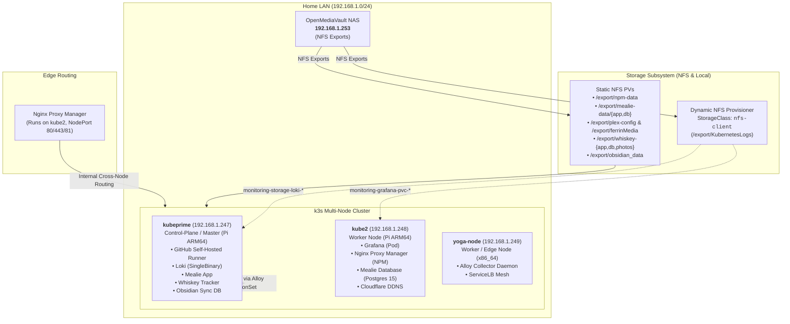
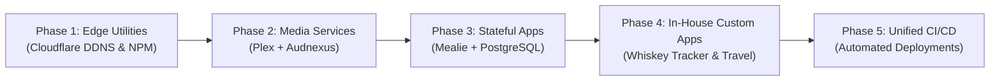

# 🏡 Ferrin Homelab Operations (`homelab-ops`)

Welcome to the **Ferrin Homelab** infrastructure and operations repository. This repository houses the Kubernetes manifests, Helm values, observability pipelines, and GitOps automation powering a multi-node hybrid Kubernetes (**k3s**) cluster running on **Raspberry Pi (ARM64)** and **x86_64** hardware, backed by an **OpenMediaVault (OMV)** Network Attached Storage (NAS) system.

---

## 📑 Table of Contents

- [Architecture Overview](#-architecture-overview)
- [Cluster Hardware & Node Inventory](#-cluster-hardware--node-inventory)
- [Two Deployment Models (GitOps vs Direct Manifests)](#-two-deployment-models-gitops-vs-direct-manifests)
- [Storage Topology & Volume Matrix](#-storage-topology--volume-matrix)
  - [Dynamic Provisioning & OMV Folder Naming](#dynamic-provisioning--omv-folder-naming)
  - [Comprehensive Storage Matrix](#comprehensive-storage-matrix)
- [Networking & Ingress Routing](#-networking--ingress-routing)
- [Service Catalog & Port Allocations](#-service-catalog--port-allocations)
- [Workload Overview](#-workload-overview)
- [Observability Stack (Loki, Alloy, Grafana)](#-observability-stack)
- [CI/CD & GitOps Automation](#-cicd--gitops-automation)
- [Operations & "Where Are My Files?" Runbook](#-operations--where-are-my-files-runbook)
- [Future Architecture & Helm Migration Roadmap](#-future-architecture--helm-migration-roadmap)
- [Security & Secrets Management](#-security--secrets-management)

---

## 🏛 Architecture Overview



---

## 🖥 Cluster Hardware & Node Inventory

The cluster is a multi-architecture hybrid running **k3s v1.33.4+k3s1** with **containerd v2.0.5-k3s2**:

| Node Name | IP Address | Roles | Architecture | OS & Kernel | Primary Workloads Hosted |
| :--- | :--- | :--- | :--- | :--- | :--- |
| **`kubeprime`** | `192.168.1.247` | `control-plane,master` | ARM64 (Raspberry Pi) | Debian 12 (bookworm) / `6.12.25+rpt-rpi-v8` | Self-hosted GitHub Runner, Loki, Mealie App, Whiskey Tracker, Obsidian Sync, CoreDNS |
| **`kube2`** | `192.168.1.248` | `worker` | ARM64 (Raspberry Pi) | Debian 12 (bookworm) / `6.12.25+rpt-rpi-v8` | Grafana, Nginx Proxy Manager, Mealie DB (Postgres 15), Cloudflare DDNS, NFS Provisioner |
| **`yoga-node`** | `192.168.1.249` | `edge,worker` | x86_64 (amd64) | Debian 13 (trixie) / `6.12.107+deb13-amd64` | Alloy collector, K3s ServiceLB proxy mesh |

---

## ⚙️ Two Deployment Models (GitOps vs Direct Manifests)

One of the most important architectural aspects of this homelab is that **workloads are managed under two different paradigms**:

### Model A: Automated GitOps & Helm (Observability & Storage)
- **Workloads**: `grafana`, `loki`, `alloy` (namespace `monitoring`), `nfs-subdir-external-provisioner` (namespace `storage`).
- **Source of Truth**: This repository (`homelab-ops`) under `k8s/monitoring/` and `k8s/storage/`.
- **How It Deploys**: A self-hosted GitHub Actions runner on `kubeprime` runs [`.github/workflows/ci.yaml`](.github/workflows/ci.yaml) on push to `main`.
- **On-Disk Checkout on the Pi**:
  ```text
  /home/mferrin/actions-runner/_work/homelab-ops/homelab-ops/
  ```
- **Runtime Configuration**: Helm compiles values directly into Kubernetes **ConfigMaps** (`grafana`, `alloy`, `loki-runtime`) and Secret release states.

### Model B: Direct Host Manifests (Application Workloads)
- **Workloads**: `npm`, `mealie`, `plex`, `familyTravel`, `cloudflare-ddns`, `obsidian`.
- **Source of Truth**: Direct YAML manifests located in `/home/mferrin/` on `kubeprime`:
  - `/home/mferrin/mealie-all-in-one.yml`
  - `/home/mferrin/npm-all-in-one.yml`
  - `/home/mferrin/plex-deployment.yml` (and associated `plex-*.yml`)
  - `/home/mferrin/cloudflare-ddns.yaml`
  - `/home/mferrin/familyTravel/familyTravel.yaml`
- **How It Deploys**: Applied manually via `sudo k3s kubectl apply -f <file>.yml`.

---

## 💾 Storage Topology & Volume Matrix

The persistent storage backbone is a dedicated **OpenMediaVault (OMV)** NAS server at **`192.168.1.253`**.

### Dynamic Provisioning & OMV Folder Naming

The cluster runs `nfs-subdir-external-provisioner` with the default StorageClass **`nfs-client`** pointing to `/export/KubernetesLogs`.

> [!IMPORTANT]
> **How Dynamic Folders are Named on OMV:**  
> When Helm or Kubernetes provisions a dynamic volume using `nfs-client`, it does **not** create a simple folder named `grafana`. Instead, it automatically generates a directory following the format:
> `/<export-root>/<namespace>-<pvc-name>-<pv-uuid>/`

| Application | Volume Claim | Exact OMV Share & Directory Path |
| :--- | :--- | :--- |
| **Grafana** | `monitoring/grafana` | `/export/KubernetesLogs/monitoring-grafana-pvc-ebd72568-2350-49de-8b50-c18169c3c3a2/` |
| **Loki** | `monitoring/storage-loki-0` | `/export/KubernetesLogs/monitoring-storage-loki-0-pvc-66c40a15-8cf0-4990-ab6d-64b0b84f28c2/` |

### Comprehensive Storage Matrix

| Volume Name | Type | OMV / Host Path | Target Pod & Mount | Capacity | Mode |
| :--- | :--- | :--- | :--- | :--- | :--- |
| `pvc-ebd725...` | Dynamic NFS | `192.168.1.253:/export/KubernetesLogs/monitoring-grafana-...` | Grafana (`/var/lib/grafana`) | 2 Gi | RWO |
| `pvc-66c40a...` | Dynamic NFS | `192.168.1.253:/export/KubernetesLogs/monitoring-storage-loki-...` | Loki (`/var/loki`) | 50 Gi | RWO |
| `nfs-npm-pv` | Static NFS | `192.168.1.253:/export/npm-data` | NPM (`/data`, `/etc/letsencrypt`) | 5 Gi | RWX |
| `nfs-mealie-app-pv` | Static NFS | `192.168.1.253:/export/mealie-data/app` | Mealie App (`/app/data`) | 15 Gi | RWX |
| `nfs-mealie-db-pv` | Static NFS | `192.168.1.253:/export/mealie-data/db` | Mealie Postgres (`/var/lib/postgresql/data`) | 10 Gi | RWX |
| `nfs-plex-config-pv`| Static NFS | `192.168.1.253:/export/plex-config` | Plex Config (`/config`) | 20 Gi | RWX |
| `nfs-plex-media-pv` | Static NFS | `192.168.1.253:/export/ferrinMedia` | Plex Media (`/media`) | 1000 Gi | RWX |
| `whiskey-app-pv` | Static NFS | `192.168.1.253:/export/whiskey-app` | Whiskey Tracker Web | 1 Gi | RWX |
| `whiskey-db-pv` | Static NFS | `192.168.1.253:/export/whiskey-db` | Whiskey Tracker DB | 10 Gi | RWO |
| `whiskey-photos-pv`| Static NFS | `192.168.1.253:/export/whiskey-photos` | Whiskey Tracker Photos | 10 Gi | RWX |
| `nfs-storage` | Static NFS | `192.168.1.253:/export/obsidian_data` | Obsidian Sync DB | 10 Gi | RWX |
| `travel-site-pv` | Static NFS | `192.168.1.253:/export/travel-db` | Travel App SQLite DB (`/app/database/travel.db`) | 1 Gi | RWX |

---

## 🌐 Networking & Ingress Routing

### NodePort Cross-Node Mesh Behavior
In Kubernetes, **a `NodePort` is accessible on every node's IP address**, regardless of where the pod is physically running:
- Grafana's pod runs on **`kube2` (`192.168.1.248`)**.
- However, pointing to **`192.168.1.247:30001` (`kubeprime`)** works seamlessly because `kube-proxy` transparently routes the packets across the internal flannel CNI network (`10.42.x.x`).
- **Nginx Proxy Manager (NPM)** is configured as the front-door reverse proxy, handling domain names and Let's Encrypt SSL certificates before proxying upstream to these NodePorts.

---

## 📋 Service Catalog & Port Allocations

| Service Name | Namespace | Node Hosted | Service Type | Internal Port | NodePort / Exposed Port | Upstream Routing URL |
| :--- | :--- | :--- | :--- | :--- | :--- | :--- |
| **Grafana** | `monitoring` | `kube2` | `NodePort` | `80` | **`30001`** | `http://192.168.1.247:30001` |
| **Mealie App** | `default` | `kubeprime` | `NodePort` | `9000` | **`30925`** | `http://192.168.1.247:30925` |
| **Mealie Database**| `default` | `kube2` | `ClusterIP` | `5432` | None (Internal) | `mealiedb-service:5432` |
| **Family Travel** | `default` | `kubeprime` | `NodePort` | `80` | **`30090`** | `http://192.168.1.247:30090` |
| **NPM HTTP/S** | `default` | `kube2` | `NodePort` | `80`, `443` | `80`, `443` | External Gateway |
| **NPM Admin UI** | `default` | `kube2` | `NodePort` | `81` | `81` | `http://<node-ip>:81` |
| **Plex Media Web** | `default` | `kube2` | `LoadBalancer` | `32400` | `32400` | `http://<node-ip>:32400` |
| **Loki Gateway** | `monitoring` | `kubeprime` | `ClusterIP` | `80` | None (Internal) | `http://loki-gateway.monitoring.svc.cluster.local` |
| **Kubernetes API** | `kube-system` | `kubeprime` | Native API | `6443` | `6443` | `https://kubeprime:6443` |

---

## 📦 Workload Overview

### 1. Observability Stack (`monitoring` namespace)
- **Grafana**: Visualizations and dashboards, pinned to NodePort `30001`, dynamically backed by 2 Gi on OMV. Pre-wired with the internal Loki datasource.
- **Loki**: Deployed in `SingleBinary` mode, TSDB v13 schema, with distributed memory caches disabled to fit comfortably within Pi RAM.
- **Grafana Alloy**: Deployed as a `DaemonSet` running on all nodes (`kubeprime`, `kube2`, `yoga-node`). It tails all pod logs and extracts structured JSON fields (`Level`, `Message`, `WhiskeyName`, `Query`) for the Whiskey Tracker app before shipping to Loki.

### 2. Application Services (`default` namespace)
- **Mealie**: Recipe manager with Google Gemini 2.0 Flash AI recipe scraping and Gmail SMTP alerts. Backed by a dedicated PostgreSQL 15 pod.
- **Whiskey Tracker**: In-house .NET 10 web application with persistent database, photos, and app shares on OMV.
- **Obsidian Sync DB**: Self-hosted CouchDB synchronization backend for Obsidian notes, persisting to `/export/obsidian_data`.
- **Cloudflare DDNS**: Automatically keeps external DNS records synchronized with the homelab's dynamic public IP.
- **Plex Media Server**: Media server with an init container cloning/updating the `Audnexus.bundle` plugin for audiobook metadata.
- **Family Travel Adventures**: Modern itinerary, packing, and meal planning web application built with **Next.js 16 (App Router)**, **React 19**, and **Prisma 7** using SQLite (`travel.db`). Deployed from the `travel` repository as a standalone Alpine container (`ghcr.io/ferrinhouse/travel-site:latest`) with automatic `prisma db push` migrations on startup, backed by `/export/travel-db` on OMV, and served via NodePort `30090`.

---

## 🚀 CI/CD & GitOps Automation

Automated deployments are managed by GitHub Actions using a self-hosted runner operating on `kubeprime`:
- **Runner Directory**: `/home/mferrin/actions-runner/`
- **Workflow**: [`.github/workflows/ci.yaml`](.github/workflows/ci.yaml)
- **Cluster Target**: Configured via `KUBECONFIG: /etc/rancher/k3s/k3s.yaml`.
- **Automated Deployments**: Upgrades Helm charts for `nfs-provisioner`, `loki`, `grafana`, and `alloy` upon any push to `main` touching `k8s/monitoring/**` or `k8s/storage/**`.

---

## 🛠 Operations & "Where Are My Files?" Runbook

### "Where Are My Files?" Debugging Guide

#### 1. Why can't I find Grafana/Loki files in `/etc/` or `/var/lib/` on my Pi?
Containers in k3s do not run on the host's raw filesystem; they run inside `containerd` isolated overlays.
- **To inspect files inside the running container**:
  ```bash
  sudo k3s kubectl exec -it -n monitoring grafana-86ccb98c8b-vqzqc -- ls -la /var/lib/grafana
  ```
- **To see the active configuration files (`grafana.ini`, `datasources.yaml`)**:
  ```bash
  sudo k3s kubectl get configmap -n monitoring grafana -o yaml
  ```

#### 2. Where is the SQLite database on OMV?
On your OMV NAS (`192.168.1.253`), navigate to the `/export/KubernetesLogs` share:
```bash
ls -la /export/KubernetesLogs/monitoring-grafana-pvc-*
```
Inside you will find `grafana.db`.

#### 3. How do I inspect the active Helm values for a release?
```bash
sudo KUBECONFIG=/etc/rancher/k3s/k3s.yaml helm get values grafana -n monitoring
```

### Routine Cluster Administration Commands

```bash
# Check all nodes and their status
sudo k3s kubectl get nodes -o wide

# Check all pods across the cluster
sudo k3s kubectl get pods -A -o wide

# Check all storage claims
sudo k3s kubectl get pvc -A

# Refresh local Windows kubectl access
# (Copy /etc/rancher/k3s/k3s.yaml from kubeprime to ~/.kube/config and replace 127.0.0.1 with 192.168.1.247)
```

---

## 🔮 Future Architecture & Helm Migration Roadmap

### The Strategic Goal: 100% GitOps & Unified Helm Management
The long-term objective for this cluster is to migrate all remaining "manual" workloads (currently deployed via loose manifests in `/home/mferrin/`) into version-controlled, Helm-managed releases in `homelab-ops`.

### Architectural Decision: Where Container & Deployment Configs Live
For custom in-house applications (**Whiskey Tracker** and **Family Travel**), homelab operations follow the standard **GitOps Separation of Concerns**:

| Repository | Scope & Responsibility | Examples |
| :--- | :--- | :--- |
| **Application Repos**<br/>(`WhiskeyTracker`, `travel`) | **Code & Artifact Build**: Contains application source code, unit tests, Dockerfile, and CI workflows that build and push container images to a registry. | `src/`, `Dockerfile`, `.github/workflows/build.yml` |
| **Infrastructure Repo**<br/>(`homelab-ops`) | **Deployment & Cluster Topology**: Contains Helm values, cluster ingress rules, NodePort allocations, and OMV storage bindings (`192.168.1.253:/export/...`). | `k8s/apps/whiskey/values.yaml`, `k8s/apps/travel/values.yaml` |

#### Why Keep Deployment Configs in `homelab-ops`?
1. **Cluster Portability**: Your application code should not know or care about internal LAN IPs (`192.168.1.253`), specific NFS share paths, or node names (`kube2`).
2. **Single Source of Truth**: Rebuilding the cluster after a disaster only requires running `homelab-ops`.
3. **Secret Containment**: Homelab database credentials and internal network topology stay inside this private infrastructure repository.

### Data Safety Guarantee: The `existingClaim` Pattern
To ensure **zero data loss** when converting existing stateful services (Plex, Mealie, NPM) to Helm:
- Helm templates will declare `existingClaim: <pvc-name>` rather than provisioning new PVCs.
- This forces Kubernetes to simply attach the existing, populated NFS directories on OMV (`192.168.1.253`) directly into the new Helm-managed pods.

### Phased Migration Roadmap



1. **Phase 1: Edge & Network Utilities (Cloudflare DDNS & Nginx Proxy Manager)**:
   - Package Cloudflare DDNS and NPM into Helm charts under `k8s/apps/`. Re-use `npm-pvc` with `existingClaim` so SSL certificates and proxy hosts remain untouched.
2. **Phase 2: Media Services (Plex Media Server)**:
   - Port the Plex deployment and Audnexus init-container into `k8s/apps/plex/`, binding to `plex-config-pvc` (20Gi) and `plex-media-pvc` (1000Gi).
3. **Phase 3: Stateful Third-Party Applications (Mealie & PostgreSQL)**:
   - Create a pre-migration backup of `mealiedb`.
   - Port Mealie to Helm using `existingClaim` for `mealie-app-pvc` and `mealie-db-pvc`.
4. **Phase 4: In-House Custom Workloads (Travel Site & Whiskey Tracker)**:
   - Both **Travel** and **Whiskey Tracker** currently manage active build/deploy pipelines in their respective code repos while in active development.
   - Once their architectures stabilize, evaluate whether to maintain their Kustomize deployment steps in their code repos or transition their release tags to Helm values in `homelab-ops`.
5. **Phase 5: Unified Pipeline Automation**:
   - Expand `.github/workflows/ci.yaml` to monitor `k8s/apps/**` and automate `helm upgrade --install` across all infrastructure workloads.

---

## 🔐 Security & Secrets Management

> [!WARNING]
> **Plaintext Secrets Notice**  
> Direct manifest files (such as `/home/mferrin/mealie-all-in-one.yml`) contain plaintext API keys and SMTP passwords.
> 
> **Recommended Improvements**:
> 1. Migrate secrets out of plain YAML into Kubernetes `Secret` resources.
> 2. For future GitOps expansion, implement **Sealed Secrets** or **SOPS** with age encryption so credentials can be safely committed to this repository.
