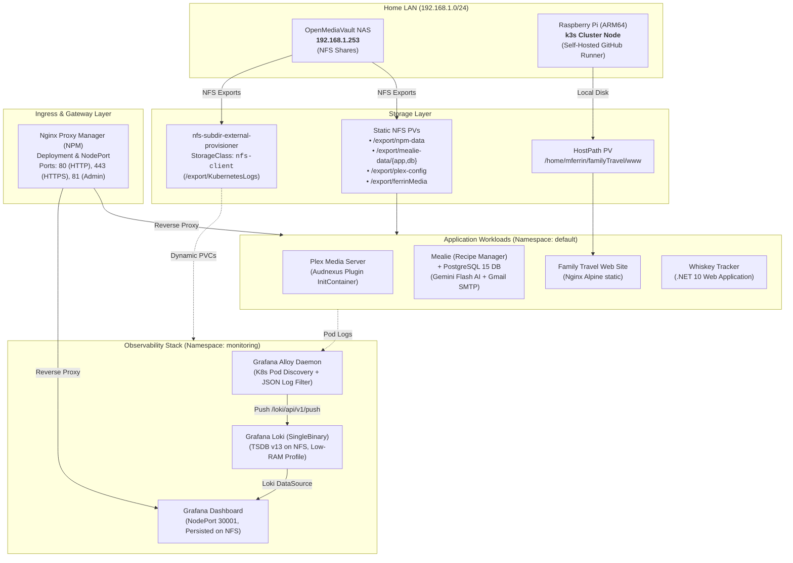

# 🏡 Ferrin Homelab Operations (`homelab-ops`)

Welcome to the **Ferrin Homelab** infrastructure and operations repository. This repository houses the Kubernetes manifests, Helm values, observability pipelines, and CI/CD automation powering a home lab built on lightweight Kubernetes (**k3s**) running on **Raspberry Pi (ARM64)** hardware, backed by an **OpenMediaVault (OMV)** Network Attached Storage (NAS) system.

---

## 📑 Table of Contents

- [Architecture Overview](#-architecture-overview)
- [Hardware & Network Topology](#-hardware--network-topology)
- [Storage Topology](#-storage-topology)
- [Networking & Ingress](#-networking--ingress)
- [Service Catalog & Port Allocations](#-service-catalog--port-allocations)
- [Workload Overview](#-workload-overview)
  - [Plex Media Server](#plex-media-server)
  - [Mealie & PostgreSQL](#mealie--postgresql)
  - [Family Travel Site](#family-travel-site)
  - [Nginx Proxy Manager](#nginx-proxy-manager)
  - [Whiskey Tracker](#whiskey-tracker)
- [Observability Stack (Loki, Alloy, Grafana)](#-observability-stack)
- [CI/CD & GitOps Automation](#-cicd--gitops-automation)
- [Operations & Runbooks](#-operations--runbooks)
- [Security & Secrets Management](#-security--secrets-management)

---

## 🏛 Architecture Overview



---

## 🖥 Hardware & Network Topology

| Component | Identifier / IP | Details |
| :--- | :--- | :--- |
| **Compute Node** | Raspberry Pi (ARM64) | Runs single-node **k3s** Kubernetes cluster; host account `mferrin` (PUID/PGID `1001`/`1002`). |
| **NAS Storage** | `192.168.1.253` | OpenMediaVault (OMV) hosting NFS exports for shared data, database backings, and media. |
| **Cluster Distribution** | k3s | Configuration managed at `/etc/rancher/k3s/k3s.yaml`. Native Traefik ingress is bypassed in favor of NPM. |
| **Cluster DNS** | `10.43.0.10` | Search domains: `default.svc.cluster.local`, `svc.cluster.local`, `cluster.local`. |
| **Subnet** | `192.168.1.0/24` | Local LAN subnet accommodating homelab hardware and client devices. |

---

## 💾 Storage Topology

The cluster utilizes a hybrid storage architecture combining **dynamic NFS provisioning**, **static NFS PersistentVolumes**, and **node-local HostPath** storage:

### 1. Dynamic Provisioner (`nfs-client`)
- **Chart**: `nfs-subdir-external-provisioner` (installed via Helm in namespace `storage`).
- **NFS Server**: `192.168.1.253`
- **NFS Path**: `/export/KubernetesLogs`
- **StorageClass**: `nfs-client` (set as the default cluster `StorageClass`).
- **Reclaim Policy**: `Retain` with `archiveOnDelete: true` to prevent accidental loss of logs and persistent state.

### 2. Storage Volume Matrix

| Volume Name | Storage Type | Source / Share Path | Target Application | Capacity | Reclaim Policy |
| :--- | :--- | :--- | :--- | :--- | :--- |
| `nfs-npm-pv` | Static NFS | `192.168.1.253:/export/npm-data` | Nginx Proxy Manager (`/data`, `/etc/letsencrypt`) | 5 Gi | Retain |
| `nfs-mealie-app-pv` | Static NFS | `192.168.1.253:/export/mealie-data/app` | Mealie App Data (`/app/data`) | 15 Gi | Retain |
| `nfs-mealie-db-pv` | Static NFS | `192.168.1.253:/export/mealie-data/db` | Mealie PostgreSQL (`/var/lib/postgresql/data`) | 10 Gi | Retain |
| `nfs-plex-config-pv` | Static NFS | `192.168.1.253:/export/plex-config` | Plex Server Config (`/config`) | 20 Gi | Retain |
| `nfs-plex-media-pv` | Static NFS | `192.168.1.253:/export/ferrinMedia` | Plex Media Library (`/media`) | 1000 Gi | Retain |
| `travel-site-pv` | HostPath | Local Pi path: `/home/mferrin/familyTravel/www` | Travel Site HTML (`/usr/share/nginx/html`) | 1 Gi | Retain |
| `loki` PVC | Dynamic NFS | `nfs-client` -> `/export/KubernetesLogs` | Loki SingleBinary Storage (`/var/loki`) | 50 Gi | Retain |
| `grafana` PVC | Dynamic NFS | `nfs-client` -> `/export/KubernetesLogs` | Grafana State & SQLite DB | 2 Gi | Retain |

---

## 🌐 Networking & Ingress

- **Reverse Proxy**: [Nginx Proxy Manager](https://nginxproxymanager.com/) (`jc21/nginx-proxy-manager:latest`) operates as the primary edge controller, providing SSL termination (Let's Encrypt) and hostname-based routing.
- **Service Exposure Pattern**: Services inside the cluster are exposed primarily via `NodePort` or `LoadBalancer` (via K3s ServiceLB/Klipper), allowing Nginx Proxy Manager to forward upstream traffic.

---

## 📋 Service Catalog & Port Allocations

| Service Name | Namespace | Type | Internal Port | External / NodePort | Description |
| :--- | :--- | :--- | :--- | :--- | :--- |
| **NPM HTTP** | `default` | `NodePort` | `80` | `80` | HTTP traffic ingestion and ACME challenge handling. |
| **NPM HTTPS** | `default` | `NodePort` | `443` | `443` | Secure HTTPS edge routing with automated SSL. |
| **NPM Admin** | `default` | `NodePort` | `81` | `81` | Web UI for managing proxy hosts and certificates. |
| **Grafana** | `monitoring` | `NodePort` | `80` | `30001` | Dashboards and observability interface. |
| **Mealie App** | `default` | `NodePort` | `9000` | `30925` | Recipe management & meal planning web interface. |
| **Mealie Database** | `default` | `ClusterIP` | `5432` | Internal | Dedicated PostgreSQL 15 database instance. |
| **Family Travel** | `default` | `NodePort` | `80` | `30090` | Lightweight static travel documentation site. |
| **Plex Web** | `default` | `LoadBalancer` | `32400` | `32400` | Plex Media Server Web UI & streaming. |
| **Plex DLNA TCP** | `default` | `LoadBalancer` | `32469` | `32469` | DLNA client communication. |
| **Plex DLNA UDP** | `default` | `LoadBalancer` | `1900` | `1900` | DLNA discovery protocol. |
| **Loki Gateway** | `monitoring` | `ClusterIP` | `80` | Internal | Ingestion and query API for Loki logs. |

---

## 📦 Workload Overview

### Plex Media Server
- **Manifests**: [`k8s/configs/plex-*.yml`](file:///c:/Users/whwar/GitHubRepos/homelab-ops/k8s/configs/)
- **Image**: `lscr.io/linuxserver/plex:latest`
- **Init Container**: `fetch-audnexus` uses an `alpine/git` container to automatically clone or update the [Audnexus bundle](https://github.com/djdembeck/Audnexus.bundle.git) into `/config/Library/Application Support/Plex Media Server/Plug-ins/Audnexus.bundle` on every pod startup for enhanced audiobook metadata.
- **Storage**: Separates heavy media assets (`/export/ferrinMedia`) from server metadata and cache (`/export/plex-config`).

### Mealie & PostgreSQL
- **Manifests**: [`k8s/configs/mealie-all-in-one.yml`](file:///c:/Users/whwar/GitHubRepos/homelab-ops/k8s/configs/mealie-all-in-one.yml)
- **Application Image**: `ghcr.io/mealie-recipes/mealie:latest`
- **Database**: Dedicated PostgreSQL 15 (`postgres:15`) container communicating via internal ClusterIP service `mealiedb-service:5432`.
- **Integrations**:
  - **AI Recipe Scraper**: Google Gemini 2.0 Flash integration configured via `OPENAI_BASE_URL` (`https://generativelanguage.googleapis.com/v1beta`).
  - **Email Alerts**: Gmail SMTP (`smtp.gmail.com:587`) for invites and notifications.

### Family Travel Site
- **Manifest**: [`k8s/configs/familyTravel/familyTravel.yaml`](file:///c:/Users/whwar/GitHubRepos/homelab-ops/k8s/configs/familyTravel/familyTravel.yaml)
- **Image**: `nginx:alpine`
- **Purpose**: Minimalist static site hosting travel itineraries and photos directly from the node's local filesystem (`/home/mferrin/familyTravel/www`).

### Nginx Proxy Manager
- **Manifest**: [`k8s/configs/npm-all-in-one.yml`](file:///c:/Users/whwar/GitHubRepos/homelab-ops/k8s/configs/npm-all-in-one.yml)
- **Image**: `jc21/nginx-proxy-manager:latest`
- **DNS Tuning**: Explicitly configures cluster DNS (`10.43.0.10`) and upstream fallback (`8.8.8.8`) with search paths to resolve internal `.cluster.local` service addresses.

### Whiskey Tracker
- **Application**: In-house .NET 10 web application emitting structured JSON telemetry.
- **Telemetry**: Pod logs are automatically discovered, relabeled, and extracted into indexed Loki labels (`whiskeyName`, `level`) by Grafana Alloy.

---

## 📊 Observability Stack

The monitoring infrastructure is deployed under the `monitoring` namespace, specifically tuned to operate within the memory constraints of a Raspberry Pi (ARM64).

### 1. Grafana Loki (`values-loki.yaml`)
- **Deployment Mode**: `SingleBinary` (distributed microservices scaled to 0 replicas to save resources).
- **Index Store**: TSDB (`schema: v13`).
- **Object Store**: Local filesystem paths mapped to NFS (`/var/loki`).
- **Pi Optimization**: Distributed caches (`chunksCache`, `resultsCache`) are explicitly disabled.

### 2. Grafana Alloy (`config.alloy`)
- **Discovery**: Automatically discovers all running pods via the Kubernetes API and extracts namespace, pod name, and container name labels.
- **Log Parsing**: Contains a dedicated pipeline stage for the **Whiskey Tracker** app:
  ```alloy
  stage.json {
    expressions = {
      level       = "Level",
      message     = "Message",
      whiskeyName = "WhiskeyName",
      query       = "Query",
    }
  }
  stage.labels {
    values = {
      level       = "level",
      whiskeyName = "whiskeyName",
    }
  }
  ```
- **Forwarding**: Sends structured entries to the internal Loki gateway at `http://loki-gateway.monitoring.svc.cluster.local/loki/api/v1/push`.

### 3. Grafana (`values-grafana.yaml`)
- **Datasource**: Pre-provisions the cluster Loki gateway as the default data source (`maxLines: 1000`).
- **Persistence**: Persists dashboards and user data onto `nfs-client` (2 Gi).
- **Access**: Exposed via NodePort `30001` for direct proxying by Nginx Proxy Manager.

---

## 🚀 CI/CD & GitOps Automation

Automated deployments are powered by GitHub Actions using a **self-hosted runner** residing on the local homelab network:

- **Workflow File**: [`.github/workflows/ci.yaml`](file:///c:/Users/whwar/GitHubRepos/homelab-ops/.github/workflows/ci.yaml)
- **Environment**: Configured with `KUBECONFIG: /etc/rancher/k3s/k3s.yaml`.
- **Triggers**:
  - Push to `main` when changes touch `k8s/monitoring/**`, `k8s/storage/**`, or `.github/workflows/ci.yaml`.
  - Manual triggers via `workflow_dispatch`.
- **Pipeline Actions**:
  1. Clones repository.
  2. Updates Helm repositories (`grafana`, `nfs-provisioner`).
  3. Upgrades/installs `nfs-subdir-external-provisioner` into namespace `storage`.
  4. Upgrades/installs `loki` into namespace `monitoring`.
  5. Upgrades/installs `grafana` into namespace `monitoring`.
  6. Upgrades/installs `alloy` into namespace `monitoring` with updated `config.alloy`.

---

## 🛠 Operations & Runbooks

### Prerequisites & Tools
Ensure you have the following installed on your management machine or host:
- `kubectl` configured with cluster access (`/etc/rancher/k3s/k3s.yaml`)
- `helm` (v3+)
- `git`
- GitHub CLI (`gh`)

### Common Operational Commands

#### 1. Checking Cluster Health
```bash
# Check node status
kubectl get nodes -o wide

# Check all running pods across namespaces
kubectl get pods -A

# Check PVC and PV binding status
kubectl get pvc -A
```

#### 2. Deploying or Updating Application Workloads
Applications in `k8s/configs/` are applied declaratively:
```bash
# Apply Nginx Proxy Manager
kubectl apply -f k8s/configs/npm-all-in-one.yml

# Apply Mealie & PostgreSQL
kubectl apply -f k8s/configs/mealie-secret.yml
kubectl apply -f k8s/configs/mealie-all-in-one.yml

# Apply Plex Media Server
kubectl apply -f k8s/configs/plex-config-pv.yml
kubectl apply -f k8s/configs/plex-config-pvc.yml
kubectl apply -f k8s/configs/plex-media-pv.yml
kubectl apply -f k8s/configs/plex-media-pvc.yml
kubectl apply -f k8s/configs/plex-service.yml
kubectl apply -f k8s/configs/plex-deployment.yml

# Apply Family Travel Site
kubectl apply -f k8s/configs/familyTravel/familyTravel.yaml
```

#### 3. Monitoring Pod Logs via Grafana Alloy & Loki
```bash
# View live Alloy collector logs
kubectl logs -n monitoring -l app.kubernetes.io/name=alloy -f

# View Loki server logs
kubectl logs -n monitoring -l app.kubernetes.io/name=loki -f
```

#### 4. Backup & Disaster Recovery Runbook
1. **OMV NFS Storage**:
   - The primary point of persistent data is the OMV NAS (`192.168.1.253`). Scheduled snapshots or rsync tasks should be configured on OMV for `/export/mealie-data`, `/export/npm-data`, and `/export/plex-config`.
2. **PostgreSQL Database Dump**:
   ```bash
   kubectl exec -it deployment/mealiedb-deployment -- pg_dump -U mealie mealiedb > mealiedb_backup_$(date +%F).sql
   ```
3. **Cluster Manifests**:
   - All cluster desired state is committed to this Git repository, allowing full cluster rebuilds by re-running K3s setup and executing the CI workflow.

---

## 🔐 Security & Secrets Management

> [!WARNING]
> **Secret Hardening Notice**
> Several configuration files (notably `k8s/configs/mealie-all-in-one.yml`) currently contain plaintext credentials for SMTP and third-party APIs (e.g., Gemini API keys and Gmail App Passwords).

### Recommended Remediation Steps
1. **Move Plaintext Keys to Kubernetes Secrets**:
   - Extract sensitive values from `mealie-all-in-one.yml` into Kubernetes `Secret` objects using `valueFrom.secretKeyRef`.
2. **Git Protection**:
   - Avoid committing unencrypted secret manifests to remote git repositories.
   - Utilize tools such as **Sealed Secrets**, **SOPS (Mozilla Secrets OPerationS)** with Age keys, or **External Secrets Operator** pulling from a local HashiCorp Vault or 1Password.
3. **Repository Workflow & Branch Protection**:
   - Direct pushes to `main` should be restricted. Follow the [Release Protocol](.antigravity/rules.md) by creating feature branches (`feature/<name>`) and opening Pull Requests via `gh pr create`.
