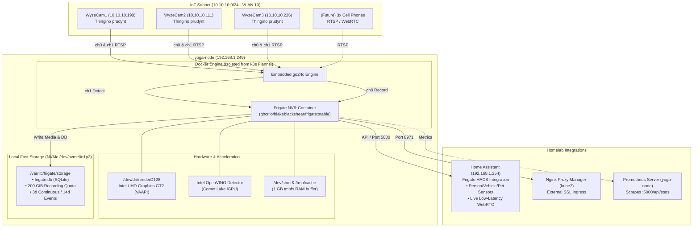

# 📹 Open Source NVR Architecture & Operations (Frigate on `yoga-node`)

This document outlines the architecture, hardware utilization, camera integrations, storage sizing, and runbook for the homelab Network Video Recorder (NVR) using **Frigate NVR** and **go2rtc**.

---

## 🏛 Architecture Overview



---

## 🖥 Hardware Profile & Compute Strategy

- **Host**: `yoga-node` (`192.168.1.249`) - Lenovo Yoga laptop running Debian 13 (trixie) x86_64.
- **CPU**: Intel Core i7-10510U (4 cores / 8 threads up to 4.90 GHz).
- **GPU / Acceleration**:
  - Intel UHD Graphics GT2 with active `/dev/dri/renderD128`.
  - Full hardware decoding for **H.264** and **H.265 (HEVC 8-bit & 10-bit)** using `preset-vaapi`.
  - Object detection runs directly on the Intel iGPU using **Intel OpenVINO** (`type: openvino`, `device: GPU`). No external Google Coral TPU hardware is required.
- **Why Standalone Docker Compose?**:
  - Running Frigate via Docker Compose isolates continuous high-bitrate video traffic from k3s and the Flannel overlay.
  - Flannel network healing or dock resets will not affect local camera ingestion or recording writes.

---

## 💾 Storage Architecture & Retention Policy

To prevent I/O saturation on the OpenMediaVault NAS (`pinas`), all NVR writes and databases reside on `yoga-node`'s local NVMe SSD (`/dev/nvme0n1p2`, which has >400 GiB unallocated free space).

### Allocation Matrix (200 GiB Quota):

| Layer | Path | Retention Setting | Estimated Footprint (6 Cameras) |
| :--- | :--- | :--- | :--- |
| **RAM Frame Buffer** | `/dev/shm` & `/tmp/cache` | In-memory `tmpfs` | 1024 MB RAM |
| **Continuous Recordings** | `/var/lib/frigate/storage/recordings` | `retain: days: 3, mode: all` | ~100–140 GiB |
| **Retained Events** | `/var/lib/frigate/storage/clips` | `retain: default: 14, mode: motion` | ~30–50 GiB |
| **Database & Metadata** | `/var/lib/frigate/storage/frigate.db` | Persistent SQLite | ~2–5 GiB |
| **Total Target** | `/var/lib/frigate/storage` | **200 GiB Soft Cap** | Leaves ~220 GiB free on NVMe |

---

## 📷 Camera Integration (Wyze Cams + Thingino)

Wyze cameras are deployed on the isolated **IoT subnet (`10.10.10.0/24`)** running custom **Thingino** firmware with the `prudynt` RTSP daemon.

### Thingino Dual-Stream Mapping:
- **Recording Stream (`ch0`)**: High resolution (1080p/2K H.264 @ 20 fps, 4000 kbps, AAC audio).  
  `rtsp://thingino:thingino@<ip>:554/ch0`
- **Detection Stream (`ch1`)**: Low resolution (640&times;360 H.264 @ 15 fps, 1000 kbps).  
  `rtsp://thingino:thingino@<ip>:554/ch1`

### Camera Inventory:

| Camera Name | IP Address | Subnet | Role |
| :--- | :--- | :--- | :--- |
| `WyzeCam1` | `10.10.10.198` | IoT (VLAN 10) | Thingino Dual-Stream RTSP |
| `WyzeCam2` | `10.10.10.111` | IoT (VLAN 10) | Thingino Dual-Stream RTSP |
| `WyzeCam3` | `10.10.10.226` | IoT (VLAN 10) | Thingino Dual-Stream RTSP |
| *Cell Phones (x3)* | *DHCP on IoT* | IoT (VLAN 10) | Future RTSP/WebRTC feeds |

---

## 🚀 Deployment & Operations Runbook

### 1. Installation on `yoga-node`

From this repository on `yoga-node` (or copied from your workstation):
```bash
# Copy setup bundle to yoga-node:
scp -r hosts/yoga-node/frigate/ mferrin@192.168.1.249:/tmp/frigate-setup/

# Run the setup script on yoga-node with sudo:
ssh -t mferrin@192.168.1.249 "sudo bash /tmp/frigate-setup/setup.sh"
```

### 2. Service Management
```bash
# Check Frigate container status
ssh mferrin@192.168.1.249 "cd /opt/frigate && docker compose ps"

# View live container logs
ssh mferrin@192.168.1.249 "cd /opt/frigate && docker compose logs -f frigate"

# Restart Frigate after editing /opt/frigate/config/config.yml
ssh mferrin@192.168.1.249 "cd /opt/frigate && docker compose restart"
```

### 3. Home Assistant Integration (`192.168.1.254`)
1. In Home Assistant, open **HACS** &rarr; **Integrations** &rarr; search for **Frigate**.
2. Download and restart Home Assistant.
3. Go to **Settings** &rarr; **Devices & Services** &rarr; **Add Integration** &rarr; select **Frigate**.
4. Enter `http://192.168.1.249:5000` as the Frigate URL.
5. All camera entities, real-time presence sensors (`sensor.wyzecam1_person_count`), and live WebRTC streams will populate automatically.

### 4. Nginx Proxy Manager Ingress (`kube2`)
To expose Frigate securely with SSL:
- **Domain**: `nvr.ferrin.homelab` (or your domain)
- **Forward Scheme / IP / Port**: `http` / `192.168.1.249` / `8971`
- **Options**: Enable **Websockets Support** (essential for MSE and go2rtc live streaming).
